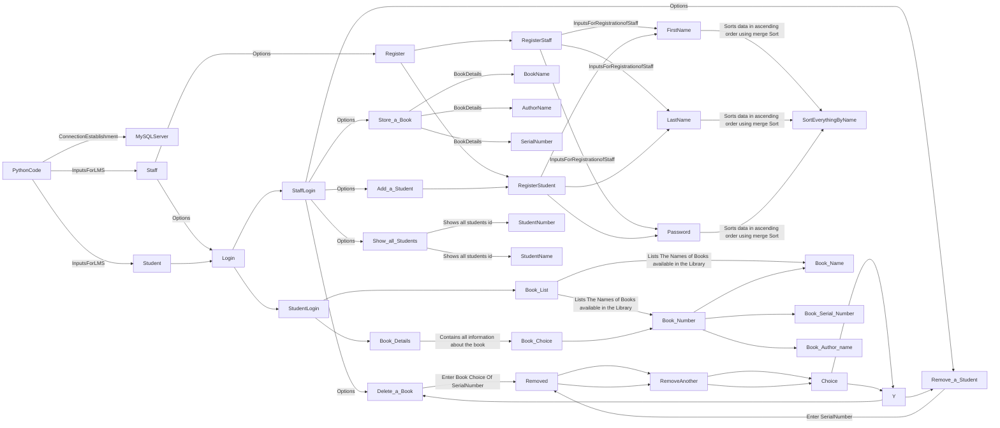

# How to use
* First copy this code to your computer
* Then before you run it make sure you have installed the MYSQL Workbench Software along with mysql. 
* You can follow the following website if you don't know how to install the mysql or mysql workbench "https://www.youtube.com/watch?v=u96rVINbAUI"
* Now that you have done that, now take the file and just run it
* Make sure that you have installed the mysql odbc for python 
* Link on how to connect the MySQL with the python : "https://www.youtube.com/watch?v=g60QghtJmjY"
* Now that youu have installed the python odbc and done everything including setting up the MySQL workbench. 
* Now just run the program with password that you provided for the MYSQL.
* In my case it is '2486'.
* Now that you have done the changes, you can now run the program
* I also have given the option to add new staff, this is just so that the user can add staff even if he hasn't created/ stored staff member details.
* From security point of view any one can exploit this program!!! LOL XD
* Secondly the main work of the program is not it's security, its how it sorts the data without using the SQL's sort funciton.
* But from School/College P.O.V I don't think you will have to think much about it, thou 😜.
# How to Secure it
* You can just add the login info at the starting page and if the details are either present in staff or student section the user will be forwarded into the 
specific page accordingly.
* We can also lock the Add/ Register new Staff such that it will only unlock with the data present in the Only one table which can't be edited by anyone other
other than the software developer or something like that.
# Result
* This is the most basic but yet Example of what Merge Sort Can Do in terms of applicability.
* This also shows that ir-respective of the type of data, if we program carefully we can implement the Merge Sort anywhere.

# Flow of Code

